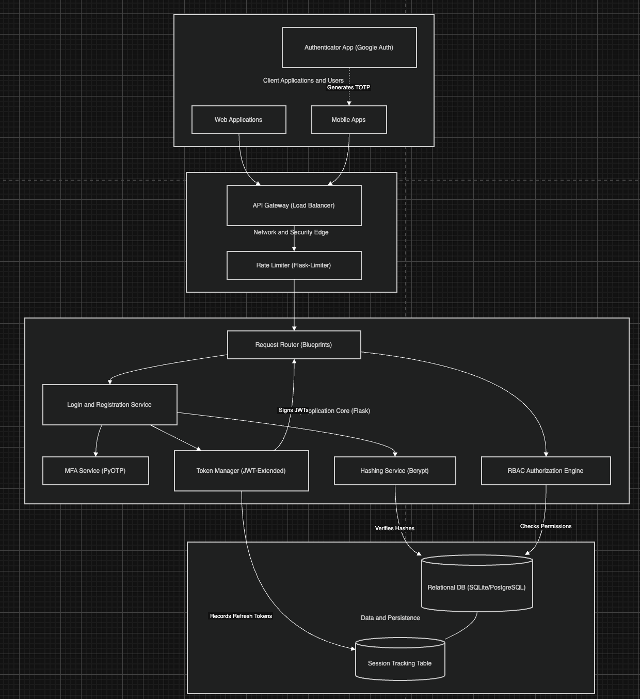
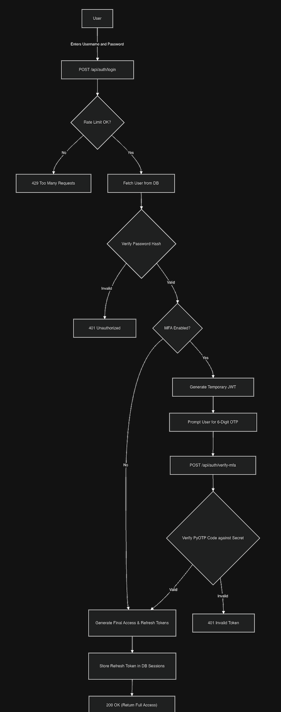
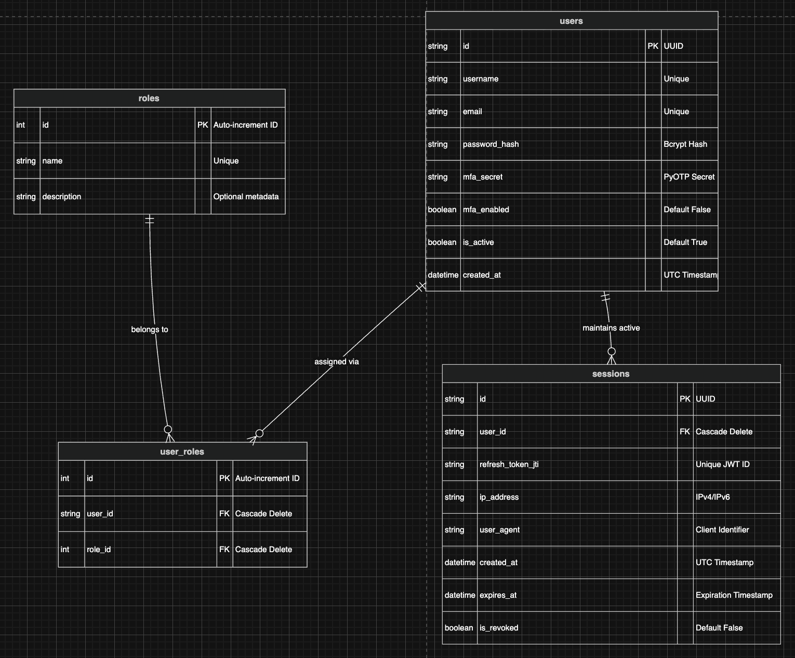

# Project Report: Digital Identity Management System

**Docs Link:** [View Google Docs Report](https://docs.google.com/document/d/1l7E7x6WijJtWIZj29DmOGWuaom4fQ-LL9poMjP9gGuc/edit?usp=sharing)

## 1. Project Overview
The **Digital Identity System** is a secure, backend application built using Python and Flask. Its primary goal is to securely manage user identities, verify who they are (Authentication), and control what they are allowed to do (Authorization). 

Think of this system as the digital "bouncer" for an application. Before anyone can access sensitive data, this system ensures their identity is real and protected.

---

## 2. Key Features Built
- **User Registration & Login:** A system where users can safely create accounts and log in.
- **Multi-Factor Authentication (MFA):** An extra layer of security that requires users to enter a 6-digit code from an app like Google Authenticator before logging in.
- **Role-Based Access Control (RBAC):** A system that assigns roles (like `admin` or `user`). Only users with the `admin` role can access certain administrative endpoints.
- **Token-Based Sessions:** Instead of keeping users logged in using server memory, we use stateless JSON Web Tokens (JWTs) that securely expire over time.
- **Brute-Force Protection:** A rate limiter that blocks IP addresses if they try to guess a password too many times rapidly.

---

## 3. Technology Stack
- **Framework:** Python / Flask
- **Database:** SQLite (managed via SQLAlchemy)
- **Security & Hashing:** Bcrypt (for passwords), PyOTP (for MFA)
- **Session Management:** Flask-JWT-Extended (JSON Web Tokens)
- **API Protection:** Flask-Limiter

---

## 4. System Architecture & Design

### Architecture Design


### Authentication Flow Design


### Data Model Design


### API Design
The system implements a RESTful API architecture. The core endpoints are categorized as follows:

**Authentication Endpoints (`/api/auth`)**
- `POST /register`: Accepts user credentials, hashes the password, and creates an account.
- `POST /login`: Validates credentials. Returns JWTs if successful, or prompts for MFA.
- `POST /verify-mfa`: Validates a 6-digit TOTP code and issues final JWTs.
- `POST /refresh`: Rotates a valid Refresh Token to issue a new Access Token.
- `POST /logout`: Blacklists the current Refresh Token in the database.

**User & Admin Endpoints**
- `GET /api/user/profile`: Returns the authenticated user's profile and roles.
- `POST /api/user/mfa/setup`: Generates an MFA secret and returns a QR code URI for Google Authenticator.
- `GET /api/admin/users`: Protected endpoint (Requires `admin` role) to list all registered users.

### Security Strategy
Our security strategy relies on multiple overlapping defense mechanisms:
1. **Password Security:** We use **Bcrypt** for hashing. Passwords are never stored or transmitted in plain text.
2. **Session Security:** We use stateless **JSON Web Tokens (JWT)**. Access tokens are short-lived (15 mins) to limit the window of compromise. Refresh tokens are tracked in the database, allowing administrators to instantly revoke stolen sessions.
3. **Identity Verification:** We use **PyOTP** to enforce Multi-Factor Authentication (MFA) via Time-Based One-Time Passwords (TOTP).
4. **Endpoint Protection:** We use **Flask-Limiter** to prevent brute-force and credential-stuffing bot attacks by limiting login attempts per IP address.
5. **Authorization:** We utilize a custom `@admin_required` Python decorator to enforce strict Role-Based Access Control (RBAC) on sensitive endpoints.

---

## 5. Understanding the Project Files
Here is a simple breakdown of how the code is organized:

- **`app.py`**: The main entry point. It brings everything together, initializes the database, and starts the server on port `5001`.
- **`models.py`**: Think of this as the blueprint for our database tables. It defines what a `User`, `Role`, and a `Session` looks like.
- **`auth.py`**: Handles everything related to getting users into the system (Register, Login, MFA Verify, Logout).
- **`user.py`**: Handles user-specific actions, like viewing their profile or generating the QR code to set up their MFA app.
- **`admin.py`**: Contains strictly protected routes. Only users assigned the `admin` role can fetch data from these endpoints.
- **`utils.py`**: A helper file containing our security math (like hashing passwords and verifying the 6-digit MFA codes).
- **`extensions.py` & `config.py`**: Setup files that configure our database and security keys.

---

## 6. Answers to Project Questions

### How are passwords stored securely?
We **never** store passwords in plain text. If a hacker breaches the database, they will not see "password123". Instead, we use **Bcrypt**. Before saving the password, Bcrypt adds random characters (called a "salt") to it and scrambles it mathematically into a long, unreadable string (a "hash"). When a user logs in, we scramble the password they type in and see if it matches the hash we saved.

### How do users stay logged in? (Token System)
When a user successfully logs in, the system gives them two digital ID cards (JSON Web Tokens):
1. **Access Token:** A short-lived pass (expires in 15 minutes) used to access the API.
2. **Refresh Token:** A long-lived pass (expires in 7 days) used only to get a new Access Token.
We store the unique ID of the Refresh Token in our database. If a user's phone is stolen, an admin can flag that Refresh Token as "revoked" in the database, instantly logging the thief out.

### How does MFA (Multi-Factor Authentication) work?
When a user sets up MFA, our system generates a unique "Secret Key" and shows it as a QR code. The user's Google Authenticator app scans it. Both the user's phone and our server use that exact same secret key and the *current time* to do a math equation. If both get the exact same 6-digit result, the system knows the user actually holds the phone!

---

## 7. Answers to Project Questions

### Q1. How will the system securely store user credentials?
**Answer:** The system uses the **Bcrypt** algorithm. Passwords are never stored in plain text. Bcrypt automatically applies a random "salt" to the password before hashing it, which prevents "rainbow table" attacks. It also uses a high computational "cost" factor to make brute-forcing the hash practically impossible.

**Implementation Code (from `utils.py`):**
```python
import bcrypt

def generate_password_hash(password: str) -> str:
    salt = bcrypt.gensalt()
    hashed = bcrypt.hashpw(password.encode('utf-8'), salt)
    return hashed.decode('utf-8')

def check_password_hash(password: str, hashed: str) -> bool:
    return bcrypt.checkpw(password.encode('utf-8'), hashed.encode('utf-8'))
```

### Q2. How will authentication tokens be managed?
**Answer:** Tokens are managed statelessly using **JSON Web Tokens (JWT)**. The system issues a short-lived Access Token (15 mins) and a long-lived Refresh Token (7 days). However, to maintain control, the unique ID (`jti`) of every Refresh Token is recorded in the `sessions` database table. When a user logs out, that specific token is marked as `is_revoked = True`, rendering it useless.

**Implementation Code (from `auth.py`):**
```python
# Decoding the token to get its unique ID and storing it securely
decoded_refresh = decode_token(refresh_token)
session = Session(
    user_id=user.id,
    refresh_token_jti=decoded_refresh['jti'],
    expires_at=datetime.datetime.fromtimestamp(decoded_refresh['exp'], tz=timezone.utc)
)
db.session.add(session)
db.session.commit()
```

### Q3. How will unauthorized access be prevented?
**Answer:** Unauthorized access is blocked through four layers of security:
1. **Invalid Credentials:** The `/login` route mathematically rejects bad passwords.
2. **MFA Enforcement:** If MFA is enabled, login returns a "Temporary Token" that lacks access rights. The user must hit the `/verify-mfa` route with their 6-digit PyOTP pin to get the real Access Token.
3. **Role-Based Access Control (RBAC):** We built a custom Python decorator (`@admin_required`) that checks the database to see if the user has the `admin` role before allowing them to fetch sensitive data.
4. **Brute Force Defense:** We use `Flask-Limiter` (`@limiter.limit("5 per minute")`) to strictly cap rapid requests per IP address, stopping bots from guessing passwords.

**Implementation Code (from `admin.py`):**
```python
from functools import wraps
from flask_jwt_extended import jwt_required, get_jwt_identity

def admin_required():
    def wrapper(fn):
        @wraps(fn)
        @jwt_required()
        def decorator(*args, **kwargs):
            user = User.query.get(get_jwt_identity())
            if not user or not user.has_role('admin'):
                return jsonify({"msg": "Admin privileges required"}), 403
            return fn(*args, **kwargs)
        return decorator
    return wrapper
```

---

## 7. How to Run the Project Locally

### Step 1: Install Dependencies
Ensure you have Python installed, then install the required libraries:
```bash
pip install -r requirements.txt
```

### Step 2: Start the Server
Run the main application file:
```bash
python app.py
```
*Note: On the first run, the system will automatically create the `identity.db` database file and generate the default `admin` and `user` roles.*

### Step 3: Test the Endpoints
You can use tools like Postman or cURL to interact with the API on `http://127.0.0.1:5001`.


